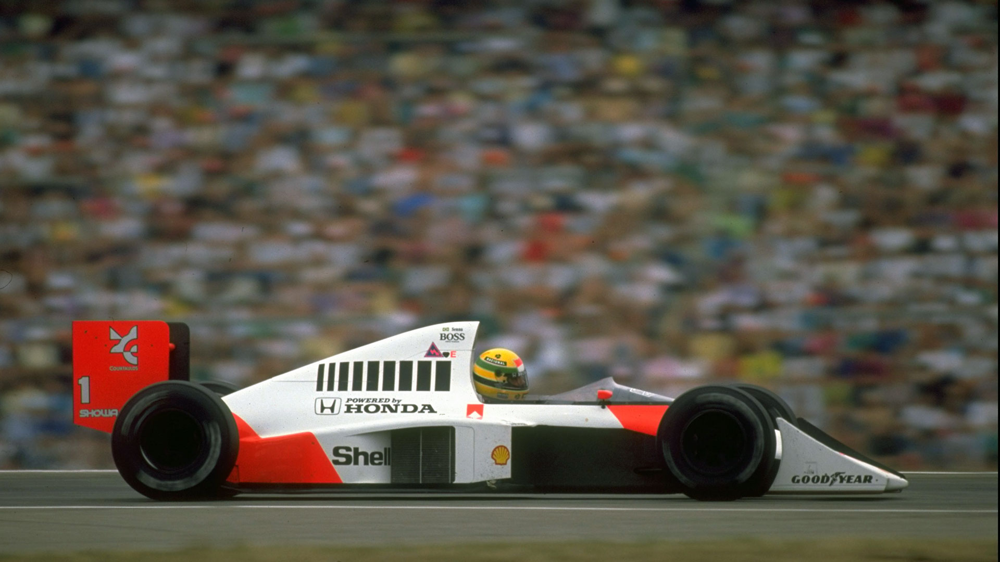

# Carousel of Images
You can see a live demo of the project [here](https://ayrton-carousel.vercel.app/).

## Why did I do this project?
I'm learning JS, and every week i do one or two projects, so i thought of project ideas, and this project seemed cool, mainly because I had never messed with jJavascript images, so thinking of a logic to do what I wanted would be very interesting.

## Theme
I'm a Brazilian, and i love "Formula 1", As a normal person in Brazil who loves Formula 1, Ayrton Senna is one of my heroes. So I do this small tribute.

## Features
- **Keyboard Navigation**: Navigate through the carousel of photos using the left and right arrow keys on your keyboard.
- **Button Navigation**: Alternatively, you can click on the navigation buttons to switch between photos.

## Issues
I'm still thinking of other ways to get this result, because the code isn't as clean, but it's efficient. (I tried to use only CSS to change the images, but it didn't work.)

## What I Learned
During the development of this project, I encountered several challenges and learned valuable lessons along the way. Here are the top things I've learned from this project:

- **Lesson 1**:  How to manipulate images with JS
- **Lesson 2**:  Action with time counters.
- **Lesson 3**:  Event listeners of keyboard actions

## Contact Information

If you have any questions, feedback, or suggestions regarding this project, feel free to reach out to me through one of the following channels:

- **Email**: [gabrielcmfontes@gmail.com](mailto:gabrielcmfontes@gmail.com)

I welcome any contributions, bug reports, or feature requests. Don't hesitate to get in touch!

